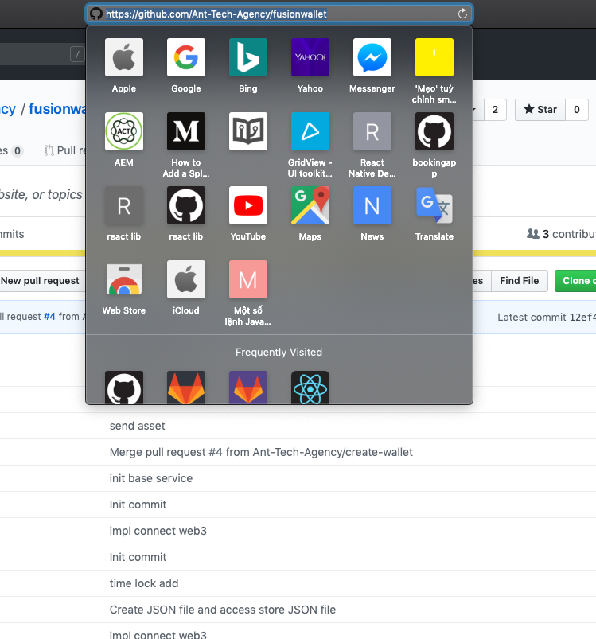

# Getting start with expo & snack

### Expo

First of all, we need to install before start
> Make sure you have Node.JS, if not you can install recommend version [here][node]

Install command:

    npm install -g expo-cli

In root folder project you can run project with:

    expo start

> After project started you can press `i` or `ios` and `a` to  for `android`

You can run this command to open ios:

    expo start --ios

And the command for  android:

    expo start --android

> To see more command, please visit [Expo Document][epDoc] 


### Specific

Everything will be ok if you **don't** use snack, but if you want to use snack please remember:
- **Don't** use `prettier` on project
- **Don't** use library what has specific way to import 
    > For example we can not use redux-saga because when you want to use effect you must import like : 

    ```javascript 
    import { takeEvery } from `redux-saga/effects`
    ```

    > And snack **don't understand** what is **"/"**


- When import project to snack as repository, please make sure repository is **public**
- Limit use Library start with specific character like `@abcxyz`

### Import to snack

**Step 1:** Copy the link of repository


**Step 2:** Go to [Snack][sack], on project folder click three dot button and chose `import git repository`

**Step 3:** Paste the link what copy at step 1 to the box, click import, and wait...


### Trouble Shoot

- After imported Snack will be send you error like:


- Don't worry, and make sure you do everything at `Specific`
- If you do everything at Specific, please wait a minute, it will success automatic 
- If you don't flow `Specific`, please check again and make sure you flow it


[node]: https://nodejs.org/en/
[epDoc]: https://docs.expo.io/versions/v34.0.0/workflow/expo-cli/#commands
[sack]: https://snack.expo.io